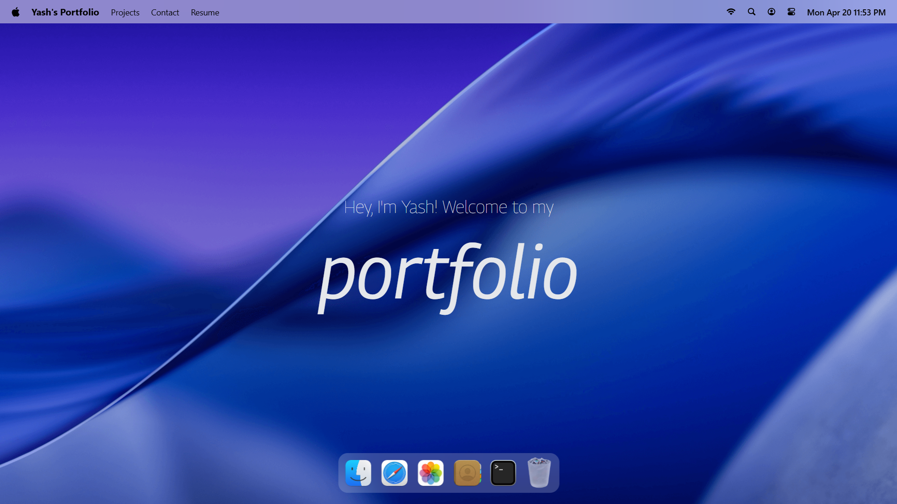

<!-- # React + Vite

This template provides a minimal setup to get React working in Vite with HMR and some ESLint rules.

Currently, two official plugins are available:

- [@vitejs/plugin-react](https://github.com/vitejs/vite-plugin-react/blob/main/packages/plugin-react) uses [Oxc](https://oxc.rs)
- [@vitejs/plugin-react-swc](https://github.com/vitejs/vite-plugin-react/blob/main/packages/plugin-react-swc) uses [SWC](https://swc.rs/)

## React Compiler

The React Compiler is not enabled on this template because of its impact on dev & build performances. To add it, see [this documentation](https://react.dev/learn/react-compiler/installation).

## Expanding the ESLint configuration

If you are developing a production application, we recommend using TypeScript with type-aware lint rules enabled. Check out the [TS template](https://github.com/vitejs/vite/tree/main/packages/create-vite/template-react-ts) for information on how to integrate TypeScript and [`typescript-eslint`](https://typescript-eslint.io) in your project. -->

# 💻 macOS Portfolio (React + Vite)

A high-performance, interactive portfolio website inspired by the macOS desktop environment. Built with **React**, **Vite** for lightning-fast bundling, **GSAP** for fluid animations, and **Tailwind CSS**.

---

## 📸 Gallery



<!-- | Desktop View | Window Management |
|---|---|
|  |  | -->

<!-- | Mobile Responsive | Interactive Dock |
|---|---|
|  |  | -->

---

## 🌟 Key Features

- **Interactive Dock:** Fully responsive dock with GSAP-powered magnification and bounce effects.
- **Window System:** Draggable and functional windows for viewing projects and "About Me" sections.
- **Vite Powered:** Instant Hot Module Replacement (HMR) for a smooth development experience.
- **Glassmorphism:** Premium Apple-inspired visuals using Tailwind's backdrop-blur filters.
- **Real-time UI:** Dynamic Top Menu Bar with live clock and system status.

## 🛠️ Tech Stack

| Category       | Technology                                      |
| :------------- | :---------------------------------------------- |
| **Frontend**   | [React.js](https://reactjs.org/)                |
| **Build Tool** | [Vite](https://vitejs.dev/)                     |
| **Styling**    | [Tailwind CSS](https://tailwindcss.com/)        |
| **Animations** | [GSAP (GreenSock)](https://greensock.com/gsap/) |
| **Icons**      | Lucide React                                    |

## 🚀 Getting Started

1. **Clone & Install:**
   ```bash
      git clone https://github.com/your-username/macos_portfolio.git
   cd macos_portfolio
   npm install
   ```
