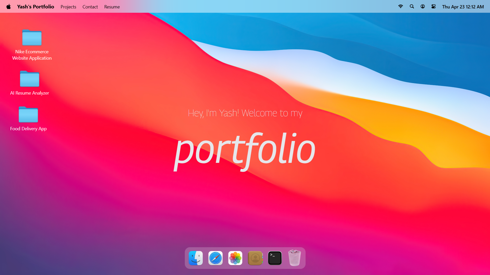

# 💻 macOS Portfolio

An interactive macOS-inspired portfolio web app built with **React**, **Vite**, **Tailwind CSS**, and **GSAP**. The project recreates a desktop-like experience with draggable windows, a Dock, Launchpad, and multiple app panels for showcasing content.

---
## 📸 Gallery

 

---


## ✨ Key Features

- **macOS-style desktop UI** with floating windows and Window Controls
- **Interactive Dock** Fully responsive dock with GSAP-powered magnification and bounce effects.
- **Boot screen animation** Before showing the desktop
- **Draggable windows** Using GSAP and custom window management
- **Glassmorphism:** Premium Apple-inspired visuals using Tailwind's backdrop-blur filters.
- **App windows** for Terminal, Safari, Finder, Text, Image viewer, VS Code-style display, Launchpad, and more
- **Real-time UI:** Dynamic Top Menu Bar with live clock and system status.

---


## 🧱 Tech Stack

- React 19
- Vite
- Tailwind CSS
- GSAP
- Zustand
- next-themes
- lucide-react
- react-pdf
- react-tooltip

---

## 📁 Project Structure

- `src/App.jsx` — main application wrapper and boot screen logic
- `src/main.jsx` — React entry point and theme provider setup
- `src/components/` — shared UI components such as Navbar, Dock, Welcome, and Home
- `src/windows/` — individual macOS-style application windows
- `public/` — static assets and images

---

## 🚀 Getting Started

### Requirements

- Node.js 20+ recommended

### Install

```bash
npm install
```

### Run locally

```bash
npm run dev
```

### Build for production

```bash
npm run build
```

### Preview production build

```bash
npm run preview
```

---

## 💡 Notes

- This repo is intended to showcase a portfolio with an immersive desktop-style UI.
- You can customize the app content and windows inside `src/windows/`.
- Add or replace screenshots in `public/` and update the README gallery as needed.
